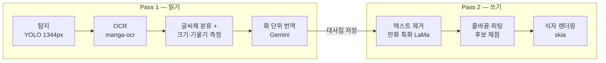

<h1 align="center">Manga-Bogopa</h1>

<p align="center"><b>일본 만화를 페이지째 넣으면, 한국어판이 나옵니다.</b></p>

<p align="center">
  탐지 → 인식 → 맥락 번역 → 흔적 없는 제거 → 원본을 닮은 식자까지,<br>
  사람 손을 거치지 않는 만화 번역 파이프라인.
</p>

<p align="center">
  
  
  
  
</p>

---

## 한눈에 보기

만화 번역의 품질은 번역문 자체보다 **식자**에서 갈립니다. 글자가 원본보다 작거나, 기울기가 어긋나거나, 지운 자리에 얼룩이 남으면 아무리 번역이 좋아도 "기계가 했다"는 티가 납니다. Manga-Bogopa는 이 마지막 단계까지 파이프라인의 일급 목표로 삼습니다.

- **원본 글자를 직접 잰다** — 글자 크기와 기울기를 모델 추측이 아니라 **잉크 기하 측정**으로 산출합니다. 투영 밴드, 연결 성분, CJK 전각의 정사각 성질을 교차 검증하는 방식으로, 자체 블라인드 벤치마크에서 회귀 모델 대비 오차를 1/5 수준으로 줄여 기본 경로가 되었습니다.
- **한국어 조판을 안다** — 조판 금칙은 물론, 어미(`인가?`·`라고요`)·기호 연속(`~~!!`)·괄호 인용구(`「···」`)를 쪼개지 않는 클러스터 줄바꿈, 원문 크기 앵커링, 페이지 내 나레이션 크기 통일, 컷 경계를 넘지 않는 가로 확장까지 — 사람 식자가 지키는 규칙을 코드로 지킵니다.
- **한 화를 통째로 번역한다** — Gemini에게 화 단위로 맥락을 주어 등장인물의 말투와 호칭이 페이지를 넘어도 일관되게 유지됩니다.

## 파이프라인



두 단계는 체크포인트로 분리됩니다. 중단해도 이어서 실행되고, 대사집(`translation_data.json`)이 남으므로 **식자 로직을 바꾼 뒤 번역 API 호출 없이 재식자만** 다시 할 수 있습니다.

| 단계 | 엔진 | 핵심 처리 |
|---|---|---|
| 탐지 | YOLO (학습 해상도 1344px) | 말풍선·텍스트 영역, 박스 병합, 고채도 일러스트 오탐 필터 |
| 인식 | manga-ocr | 후리가나 포함 세로 일본어 배치 추론 |
| 분석 | 분류 모델 + 잉크 기하 측정 | 글씨체(외침/손글씨/나레이션…), 글자 크기·기울기 실측 |
| 번역 | Gemini (google-genai) | 화 단위 맥락 번역, 누락 자동 재요청, 장애 시 지수 백오프 |
| 제거 | 만화 특화 LaMa (FFC) | 적응형 컨텍스트 패딩, 패치 소유권 합성, 말풍선 테두리 보호 |
| 식자 | skia | 클러스터 줄바꿈, 크기 앵커링, 세로쓰기 단일 단, 글리프 폴백 |

## 식자가 지키는 규칙

<table>
<tr><td><b>크기</b></td><td>번역문은 원문에서 잰 글자 크기에 앵커링됩니다. 공간이 모자라면 단어 중간 개행을 '마지막 수단'으로 허용해 크기를 지키고, 같은 페이지에 나열된 나레이션은 다수 크기로 통일합니다.</td></tr>
<tr><td><b>방향</b></td><td>한국어는 가로쓰기가 원칙. 세로쓰기는 매우 길쭉한 박스에만, 항상 단일 단으로 들어갑니다.</td></tr>
<tr><td><b>기울기</b></td><td>투영 선명도 탐색으로 원문 기울기를 ±0.5° 수준으로 복원합니다. 똑바른 원문에 잡음 기울기가 섞이지 않도록 신뢰도 게이트가 걸러냅니다.</td></tr>
<tr><td><b>줄바꿈</b></td><td>조판 금칙(행두·행말 금지)과 함께, 어미·기호 연속·괄호 인용구를 한 덩어리로 묶어 <code>~</code> 다음 줄 <code>~!!</code> 같은 분리가 일어나지 않습니다.</td></tr>
<tr><td><b>배치</b></td><td>가로 확장 전 양옆을 스캔해 컷 경계(다른 칸)와 이미지 끝을 넘지 않습니다. 한쪽만 막혀 있으면 그쪽으로 정렬하고 열린 쪽으로만 퍼집니다.</td></tr>
<tr><td><b>지우기</b></td><td>지울 영역은 넉넉히 잡되 말풍선 테두리는 자동 보호. 어두운 배경에서는 글자색·외곽선을 자동 반전합니다.</td></tr>
</table>

## 시작하기

**요구사항** — Python 3.11+, CUDA GPU 권장(VRAM 8GB+). CPU로도 동작하지만 느립니다.

```bash
git clone https://github.com/DoohyunHeo/Manga-Bogopa.git
cd Manga-Bogopa
pip install -r requirements.txt
python main.py
```

브라우저에서 `http://127.0.0.1:7860` 을 열면 웹 UI가 뜹니다. 첫 실행이라면 설정 화면에서 **Google Gemini API 키**를 입력하세요. 설정은 `config.json`에 저장되며 저장소에 포함되지 않습니다.

**모델과 폰트**

| 파일 | 위치 | 구하는 곳 |
|---|---|---|
| 탐지 모델 (`MangaTextExtractor-V2.pt`) | `data/models/` | [Releases](../../releases) |
| 글씨체 분류 모델 (`font_appearance_analyzer.pth`) | `data/models/` | [Releases](../../releases) |
| 인페인팅 LaMa / OCR manga-ocr | `data/models/` | 첫 실행 시 자동 다운로드 |
| 식자용 한국어 폰트 (.ttf/.otf) | `data/fonts/` | 직접 준비 — 스타일별 연결은 웹 UI에서 |

`data/inputs/` 에 만화 이미지를 넣고 실행 버튼을 누르면, 진행 상황과 완성 페이지가 실시간 갤러리로 표시됩니다.

## 웹 UI

- 입력/출력 폴더 선택, 실행·중단, 단계별 진행률과 실시간 완성 갤러리
- 체크포인트 이어하기 — 중단 지점부터 재개, 이미 번역된 페이지는 다시 묻지 않음
- **모든** 설정이 GUI에 노출되며, 항목마다 개발 지식이 없어도 이해할 수 있는 설명이 붙어 있습니다
- 번역 프롬프트 편집기 — 말투·호칭·의성어 처리 방침을 직접 조정 가능

## 프로젝트 구조

```
src/
├── detection.py        탐지 + 박스 병합            glyph_metrics.py   잉크 기하 측정 (크기·기울기)
├── batch_manga_ocr.py  OCR 배치 추론               font_analysis.py   글씨체 분류 + 속성 통합
├── page_structure.py   말풍선 매칭·크기 통일        extractor.py       Pass 1 오케스트레이션
├── translator.py       Gemini 세션·재요청           inpainter.py       제거 (마스크·소유권 합성)
├── lama_ffc.py         만화 특화 LaMa 생성기        text_layout.py     배치 정책 (방향·정렬·경계)
├── text_fitting.py     크기 피팅·후보 채점          text_wrapping.py   클러스터 줄바꿈·금칙
├── text_renderer.py    skia 렌더링                 page_drawer.py     페이지 식자 오케스트레이션
└── pass1_stage.py · pass2_stage.py · checkpoint.py · config.py
web/        Gradio UI (테마·핸들러·상태)
pipeline.py 전체 파이프라인        main.py 진입점
```

## 자주 묻는 질문

**Q. 중간에 껐는데 처음부터 다시 하나요?**
아니요. 체크포인트가 단계별로 남아 이어서 실행됩니다. 번역까지 끝난 화면 식자만 다시 합니다.

**Q. 번역은 그대로 두고 식자만 다시 하고 싶어요.**
출력 폴더의 `translation_data.json`이 대사집입니다. 같은 출력 폴더로 다시 실행하면 저장된 번역을 재사용합니다.

**Q. 효과음(배경 의성어)은 왜 안 바뀌나요?**
의도된 동작입니다. 그림과 한 몸인 연출 효과음은 원본 보존이 자연스럽다고 보고, 대사·나레이션·손글씨 혼잣말·소개 카드만 번역 대상으로 삼습니다.

**Q. GPU가 없으면?**
동작은 하지만 탐지·인페인팅이 크게 느려집니다. 실사용은 CUDA GPU를 권장합니다.

## 로드맵

- 탐지 리콜 개선 (나레이션·손글씨·소개 카드, 컬러 페이지)
- 글씨체 분류 정확도 고도화
- 식자 품질 자동 검수 루프 확장

## 기반 기술

[manga-ocr](https://github.com/kha-white/manga-ocr) · [Ultralytics YOLO](https://github.com/ultralytics/ultralytics) · [AnimeMangaInpainting (LaMa)](https://huggingface.co/dreMaz/AnimeMangaInpainting) · [Google Gemini](https://ai.google.dev/) · [skia-python](https://github.com/kyamagu/skia-python) · [Gradio](https://www.gradio.app/)

## 이용 안내

입력 이미지에 대한 권리는 사용자에게 있습니다. 본 도구는 권리를 보유했거나 허락받은 작품의 개인적·합법적 이용 범위 내에서 사용하세요.
