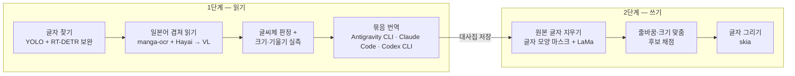

<h1 align="center">Manga-Bogopa</h1>

<p align="center"><b>일본 만화를 페이지째 넣으면, 한국어판이 나옵니다.</b></p>

<p align="center">
  글자를 찾아 읽고, 문맥을 살려 번역하고, 원본 글자를 지운 자리에<br>
  원본을 닮은 글씨로 다시 써 넣는 일까지 — 사람 손 없이 한 번에 끝냅니다.
</p>

<p align="center">
  
  
  
  
</p>

---

## 한눈에 보기

만화 번역의 완성도는 번역문보다 **식자**(글자를 그림 위에 얹는 일)에서 갈립니다. 글씨가 원본보다 작거나, 기울기가 어긋나거나, 지운 자리에 얼룩이 남으면 아무리 번역이 좋아도 "기계가 했구나" 하는 티가 납니다. Manga-Bogopa는 이 마지막 마무리까지 똑같이 공을 들입니다.

- **원본 글씨를 직접 잰다** — 글씨 크기와 기울기를 모델이 어림잡게 두지 않고, 그려진 글자의 획을 픽셀 단위로 재서 알아냅니다. 자체 비교 실험에서 예측 모델보다 오차가 1/5 수준으로 작아, 이 실측 방식을 기본으로 씁니다.
- **한국어 식자의 관행을 안다** — 문장 부호가 줄 머리에 오지 않게 하는 기본기부터, 어미(`인가?`·`라고요`)와 이어지는 기호(`~~!!`), 짧은 인용구(`「···」`)가 줄바꿈에 갈라지지 않게 묶는 것, 같은 페이지 나레이션의 글씨 크기를 맞추는 것까지 — 사람 식자가 손으로 지키던 규칙을 코드로 지킵니다.
- **여러 쪽을 묶어 문맥째 번역한다** — 페이지를 낱장씩 번역하지 않고 최대 12쪽씩 묶어, 대사를 읽는 순서대로 앞뒤 문맥과 함께 보냅니다. 묶음마다 새 대화로 보내되, 책 하나의 인명·용어 사전을 함께 실어 이름 표기를 맞추고, 다 번역한 뒤에는 틀렸을 수 있는 대사(한두 글자 다르게 읽힌 이름, 칸에 잘린 말 등)만 한 번 더 물어 바로잡습니다.

## 파이프라인


```mermaid
flowchart LR
    subgraph P1["1단계 — 읽기"]
        A[글자 찾기<br>YOLO + RT-DETR 보완] --> B[일본어 겹쳐 읽기<br>manga-ocr + Hayai → VL]
        B --> C[글씨체 판정 +<br>크기·기울기 실측]
        C --> D[묶음 번역<br>Antigravity CLI · Claude Code · Codex CLI]
    end
    subgraph P2["2단계 — 쓰기"]
        E[원본 글자 지우기<br>글자 모양 마스크 + LaMa] --> F[줄바꿈·크기 맞춤<br>후보 채점]
        F --> G[글자 그리기<br>skia]
    end
    D -->|대사집 저장| E
```

두 단계는 따로 저장됩니다. 중간에 꺼도 이어서 돌릴 수 있고, 번역 결과가 대사집(`translation_data.json`)으로 남기 때문에 **번역은 그대로 두고 글자만 다시 얹는** 것도 가능합니다 — 이때는 번역을 다시 요청하지 않습니다.

| 단계 | 엔진 | 하는 일 |
|---|---|---|
| 글자 찾기 | YOLO (학습 해상도 1344px) + RT-DETR 보완 | 말풍선·글자 위치 찾기, YOLO가 아무것도 못 찾은 자리만 RT-DETR로 한 번 더 찾아 채우기, 겹친 영역 합치기, 그림을 글자로 착각한 오탐 거르기 |
| 읽기 | manga-ocr + Hayai (엇갈리면 PaddleOCR-VL-For-Manga) | 두 가지 방법으로 묶어 읽고, 서로 다르게 읽은 조각만 만화용 시각언어모델로 다시 읽기 |
| 분석 | 분류 모델 + 획 실측 | 글씨체(외침/손글씨/나레이션…) 판정, 글씨 크기·기울기 재기 |
| 번역 | Antigravity CLI · Claude Code · Codex CLI (자동이면 설치된 것) | 최대 12쪽씩 묶어 요청마다 새 대화로 보내는 문맥 번역, 책 하나의 인명·용어 사전으로 표기 맞추기, 틀렸을 수 있는 대사만 다시 묻는 의심 대사 확인, 빠진 대사 자동 재요청, 실패한 대사는 다음 실행에서 그것만 다시 요청 |
| 지우기 | comic-text-mask + 만화 특화 LaMa | 말풍선 안은 넉넉한 박스로, 말풍선 밖은 글자 모양대로만 지워 뒤의 그림·톤·검은 바탕 보존, 주변 그림을 함께 보며 메우기, 말풍선 테두리 보호 |
| 식자 | skia | 자연스러운 줄바꿈, 원본 크기 따라가기, 세로쓰기, 폰트에 없는 글자는 대체 폰트로 |

## 식자가 지키는 규칙

<table>
<tr><td><b>크기</b></td><td>번역문 글씨는 원본에서 잰 크기를 따라갑니다. 자리가 모자라면 글씨를 줄이는 대신 단어 중간에서라도 줄을 바꿔 크기를 지키고, 같은 페이지에 나란히 놓인 나레이션은 크기를 맞춥니다.</td></tr>
<tr><td><b>방향</b></td><td>한국어는 가로쓰기가 원칙. 세로쓰기는 아주 길쭉한 자리에만 쓰고, 말풍선 안에서는 한 줄로만 세웁니다. 말풍선 밖의 긴 세로 해설 띠만 여러 줄로 세울 수 있습니다.</td></tr>
<tr><td><b>기울기</b></td><td>원본 글씨가 기울어 있으면 그 각도를 ±0.5° 수준까지 따라갑니다. 똑바로 쓰인 글씨가 괜히 삐뚤어지지 않도록, 확실할 때만 기울입니다.</td></tr>
<tr><td><b>줄바꿈</b></td><td>문장 부호로 줄이 시작하거나 여는 괄호로 줄이 끝나지 않습니다. 어미·이어지는 기호·괄호 인용구는 한 덩어리로 움직여서, <code>~</code> 다음 줄에 <code>~!!</code>가 오는 식의 어색한 분리가 생기지 않습니다.</td></tr>
<tr><td><b>배치</b></td><td>글자가 옆으로 퍼질 때 만화 칸의 경계와 페이지 끝을 넘지 않습니다. 한쪽이 막혀 있으면 그쪽에 붙이고, 열린 쪽으로만 폅니다.</td></tr>
<tr><td><b>지우기</b></td><td>말풍선 안 글자는 흔적이 남지 않게 넉넉히 지우되, 말풍선 테두리 선은 건드리지 않습니다. 그림 위에 쓰인 말풍선 밖 글자는 글자 모양대로만 지워서 뒤에 있던 그림·톤·검은 바탕을 살리고, 모델이 놓친 후리가나·줄표 같은 곁 조각도 함께 지웁니다.</td></tr>
<tr><td><b>글자색·테두리</b></td><td>원문 글자에 흰(또는 검은) 테두리가 있으면 비슷한 두께로 두르고, 검은 말풍선 속 흰 글자는 흰 글자로 씁니다. 원문을 확실히 잴 수 없을 때는 검은 글자에 흰 테두리를 두르고, 지운 자리가 어두우면 색을 맞바꿉니다.</td></tr>
</table>

## 시작하기

**필요한 것** — Python 3.11 이상, CUDA GPU 권장(VRAM 8GB 이상), 번역용 CLI 하나 — [Antigravity CLI](https://antigravity.google/)(구글 계정), [Claude Code](https://github.com/anthropics/claude-code), [Codex CLI](https://github.com/openai/codex) 가운데 아무거나. CPU만으로도 돌아가지만 많이 느립니다.

```bash
git clone https://github.com/DoohyunHeo/Manga-Bogopa.git
cd Manga-Bogopa
pip install -r requirements.txt
python main.py
```

번역은 **Antigravity CLI**, **Claude Code**, **Codex CLI** 가운데 하나가 맡습니다. 설정의 '자동'(기본)은 설치된 것 중에서 이 순서로 고르고, 설정에서 하나를 직접 고를 수도 있습니다. 쓸 CLI를 설치한 뒤 터미널에서 한 번 실행해 로그인해 두세요 — Antigravity CLI는 `agy`(구글 계정, Windows PowerShell 설치: `irm https://antigravity.google/cli/install.ps1 | iex`), Claude Code는 `claude`, Codex CLI는 `codex login`. API 키는 필요 없습니다.

`python main.py`를 실행하면 브라우저에 웹 화면(`http://127.0.0.1:7860`)이 열립니다. 이 컴퓨터에서만 열리는 화면이고, 설정은 `config.json`, 책장 목록은 `library.json`에 저장되며 저장소에는 올라가지 않습니다. 번역 CLI를 하나도 찾지 못하면 첫 화면이 Antigravity CLI 설치·로그인 순서를 안내합니다.

**모델과 폰트**

| 파일 | 두는 곳 | 구하는 곳 |
|---|---|---|
| 탐지 모델 (`MangaTextExtractor-V2.pt`) | `data/models/` | 첫 실행 때 [Releases](../../releases)(`models-v1`)에서 자동으로 내려받음 (약 44MB) |
| 글씨 모양 모델 (`font_style6_analyzer.pth`) | `data/models/` | 첫 실행 때 [Releases](../../releases)(`models-v1`)에서 자동으로 내려받음 (약 116MB) |
| 지우기 LaMa | `data/models/` | 첫 실행 때 자동으로 내려받음 |
| 읽기 manga-ocr | Hugging Face 캐시 | 첫 실행 때 자동으로 내려받음 |
| 글자 모양 마스크 ([comic-text-mask](https://huggingface.co/TareHimself/comic-text-mask)) | Hugging Face 캐시 | 첫 실행 때 자동으로 내려받음 (약 60MB) |
| 보완 탐지 모델 ([comic-text-and-bubble-detector](https://huggingface.co/ogkalu/comic-text-and-bubble-detector)) | Hugging Face 캐시 | 첫 실행 때 자동으로 내려받음 (약 170MB) |
| 읽기 보조 ([Hayai OCR](https://huggingface.co/JustANormalTinkerer/hayai-ocr-v2.5-nova) · [PaddleOCR-VL-For-Manga](https://huggingface.co/jzhang533/PaddleOCR-VL-For-Manga)) | Hugging Face 캐시 | 첫 실행 때 자동으로 내려받음 (약 2.5GB) |
| 식자용 한국어 폰트 (.ttf/.otf) | `data/fonts/` | 직접 준비 — 글씨체별 연결은 웹 화면에서 |

**새 책 번역하기**로 만화 쪽 그림이 든 폴더를 고르고 **번역 시작**을 누르면 됩니다. 결과는 그 폴더 옆 `<폴더 이름>_번역` 폴더에 같은 파일 이름으로 저장됩니다.

## 웹 화면

- **책장** — 번역한 책이 표지와 함께 쌓이고, 책마다 완료·진행 중·번역 못 한 대사 수가 보임
- **책 화면** — 읽기 → 번역 → 지우고 쓰기 세 단계와 남은 시간, 끝난 쪽은 목록에서 바로 번역본으로 바뀜. 멈춘 책은 **이어서 번역**으로 멈춘 곳부터(번역을 못 받은 대사만 다시 요청), 메뉴에서 **글자만 다시 쓰기**(번역 요청 없음)와 **처음부터 다시 번역**(이전 번역은 백업)
- **쪽 보기** — 어두운 바탕에서 한 쪽씩, 막대를 밀어 원본과 비교, ←/→로 넘기기
- **번역 고치기** — 쪽 그림 위에서 말풍선을 눌러 그 자리에서 고치고, 그 쪽만 다시 식자(번역 요청 없음)
- **설정** — 번역에 쓸 AI(Antigravity CLI·Claude Code·Codex CLI)와 모델·생각 깊이, 번역 동시 진행(한 번에 보낼 번역 묶음 수), 좁은 말풍선 한 번 더 짧게 번역하기(기본 끔), 원문 글씨 모양별 글꼴(미리보기, 굵은 대사 글꼴은 저절로 정해짐), 해설도 평범한 대사 글꼴로 쓰기, 세로쓰기, 외침 기울여 쓰기(기본 끔), 그래픽카드 메모리 아끼기뿐. 나머지는 여러 작품으로 시험해 가장 나았던 값으로 정해 두었고, 저장해 둔 예전 값에 끌려가지 않음
- 번역 지침은 저장소의 `prompt.txt`를 그대로 씀
- 화면 원본은 `web/frontend`(React)에 있고, 빌드한 결과 `web/dist`를 함께 넣어 두어 Node 없이 돈다. 화면을 고칠 때만 `cd web/frontend && npm install && npm run build`

## 프로젝트 구조

```
src/
├── detection.py        말풍선·글자 찾기           glyph_metrics.py   글씨 크기·기울기 실측
├── ocr_ensemble.py     일본어 겹쳐 읽기 (OCR)      font_analysis.py   글씨체 판정
├── page_structure.py   말풍선-글자 짝짓기          extractor.py       읽기 단계 보조
├── translator.py       번역 요청 (번역 CLI)        inpainter.py       원본 글자 지우기
├── glossary.py         인명·용어 사전             font_relative.py   책 단위 글씨체·굵기 판정
├── fit_translation.py  좁은 말풍선 짧은 번역       batch_manga_ocr.py manga-ocr 묶어 읽기
├── lama_ffc.py         만화 특화 지우기 모델        text_layout.py     글자 배치 결정
├── text_fitting.py     글씨 크기 맞추기            text_wrapping.py   줄바꿈 규칙
├── text_renderer.py    글자 그리기 (skia)          page_drawer.py     페이지 단위 식자
└── pass1_stage.py · pass2_stage.py · checkpoint.py · config.py · font_model.py
web/        웹 화면 — server.py(FastAPI) · jobs.py(번역 작업) · library.py(책장) · frontend/(React 원본) · dist/(빌드)
pipeline.py 전체 흐름 총괄        main.py 실행 시작점
```

## 자주 묻는 질문

**Q. 중간에 껐는데 처음부터 다시 하나요?**
아니요. 진행 상황이 단계별로 저장되어 책 화면에서 **이어서 번역**을 누르면 멈춘 곳부터 이어집니다. 번역에 실패한 대사가 있으면 그 대사만 다시 요청하고, 입력 그림을 바꿔 넣은 페이지는 알아서 새로 처리합니다.

**Q. 번역은 그대로 두고 식자만 다시 하고 싶어요.**
결과 폴더의 `translation_data.json`이 대사집입니다. 책 화면 메뉴(⋯)의 **글자만 다시 쓰기**를 누르면 저장된 번역으로 글자만 다시 얹습니다 (번역 요청 없음). 글꼴을 바꾼 뒤에 쓰면 됩니다.

**Q. 번역 몇 줄만 고치고 싶어요.**
쪽을 크게 열고 고칠 말풍선을 누르면 그 자리에 원문과 번역 칸이 뜹니다. 고친 뒤 **저장하고 이 쪽 다시 쓰기**를 누르면 그 쪽만 몇 초 만에 다시 식자합니다 (번역 요청 없음). 효과음처럼 번역하지 않고 둔 글자도 **고칠 자리 보기**로 찾아 번역을 적어 넣을 수 있고, 번역을 비우면 원문을 그대로 둡니다.

**Q. 효과음(배경 의성어)은 왜 안 바뀌나요?**
일부러 그렇게 했습니다. 그림과 한 몸인 연출 효과음은 원본 그대로가 자연스럽다고 보고, 대사·나레이션·손글씨 혼잣말·소개 카드만 번역합니다.

**Q. GPU가 없으면요?**
돌아가긴 하지만 글자 찾기와 지우기가 크게 느려집니다. 실사용에는 CUDA GPU를 권장합니다.

## 앞으로 할 일

- 놓치는 글자 줄이기 (나레이션·손글씨·소개 카드, 컬러 페이지)
- 글씨체 판정 정확도 높이기
- 식자 결과 자동 검수 확대

## 기반 기술

[manga-ocr](https://github.com/kha-white/manga-ocr) · [Hayai OCR](https://huggingface.co/JustANormalTinkerer/hayai-ocr-v2.5-nova) · [PaddleOCR-VL-For-Manga](https://huggingface.co/jzhang533/PaddleOCR-VL-For-Manga) · [Ultralytics YOLO](https://github.com/ultralytics/ultralytics) · [comic-text-and-bubble-detector (RT-DETR-v2)](https://huggingface.co/ogkalu/comic-text-and-bubble-detector) · [comic-text-mask](https://huggingface.co/TareHimself/comic-text-mask) · [AnimeMangaInpainting (LaMa)](https://huggingface.co/dreMaz/AnimeMangaInpainting) · [Google Antigravity CLI](https://antigravity.google/) · [skia-python](https://github.com/kyamagu/skia-python)

## 이용 안내

입력 이미지에 대한 권리는 사용자에게 있습니다. 권리를 갖고 있거나 허락받은 작품을, 개인적이고 합법적인 범위 안에서 이용해 주세요.
